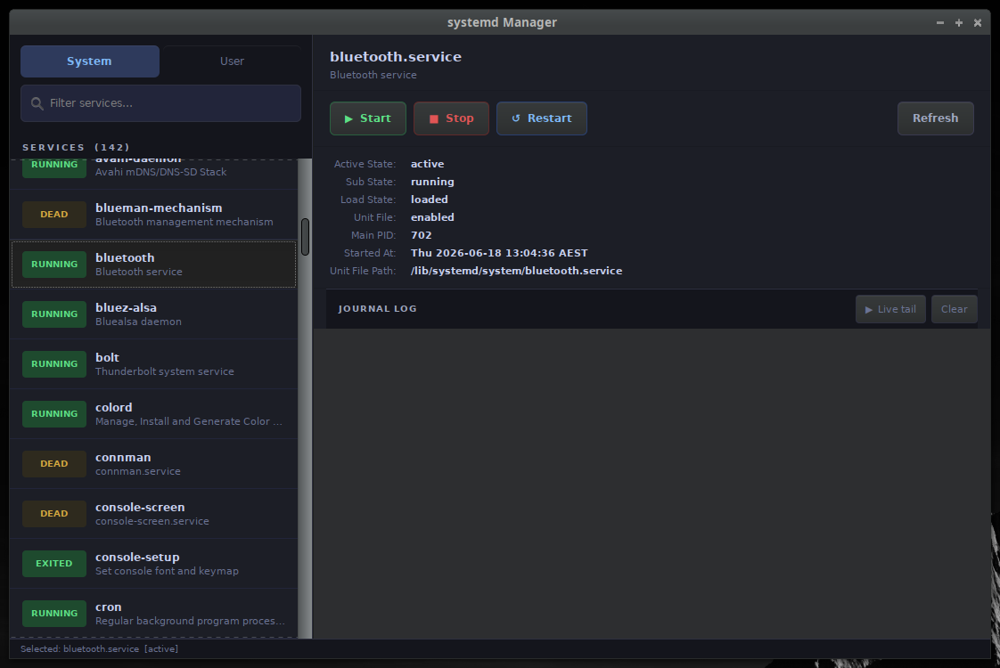

# systemd Manager

A GTK3 GUI to view and control systemd services,
with live journald log tailing.

## Requirements

```bash
# Python 3 + GTK3 bindings (usually pre-installed on Xubuntu)
sudo apt install python3-gi python3-gi-cairo gir1.2-gtk-3.0
```

## Running

```bash
chmod +x systemd-manager.sh
./systemd-manager.sh
```

> **Note on system services:** Starting/stopping *system* services requires
> root. Run with `sudo` or `pkexec` if you get permission errors:
>
> ```bash
> sudo python3 systemd_manager.py
> # or
> pkexec python3 systemd_manager.py
> ```
>
> *User* services (the "User" tab) run as your own user and need no elevation.

## Install to application menu

```bash
# Edit the Exec= line in the .desktop file to the full path first:
sed -i "s|/path/to/systemd-manager.sh|$(pwd)/systemd-manager.sh|g" systemd-manager.desktop

chmod +x systemd-manager.sh
cp systemd-manager.desktop ~/.local/share/applications/
```

## Features

| Feature | Description |
|---------|-------------|
| System / User scope | Toggle between system-wide and per-user services |
| Status badges | ACTIVE · RUNNING · INACTIVE · FAILED · DEAD at a glance |
| Filter | Real-time search by service name |
| Start / Stop / Restart | One-click service control |
| Properties panel | ActiveState, PID, unit file path, start timestamp, etc. |
| Live log tail | Streams `journalctl -f` output into the GUI in real time |
| Clear log | Wipe the log buffer without stopping the tail |


## Screenshot


